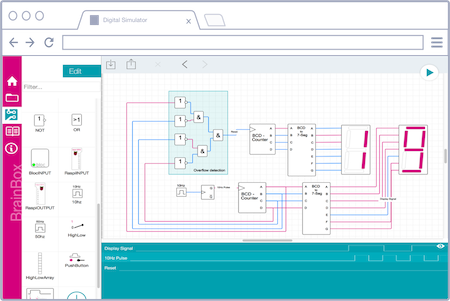
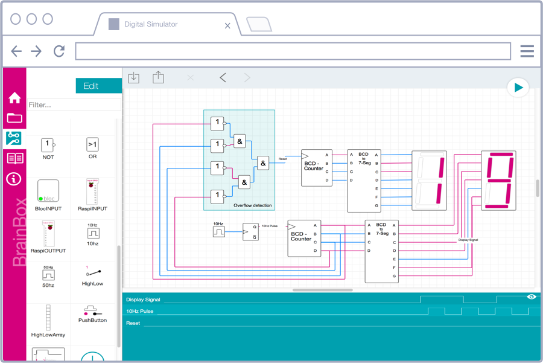
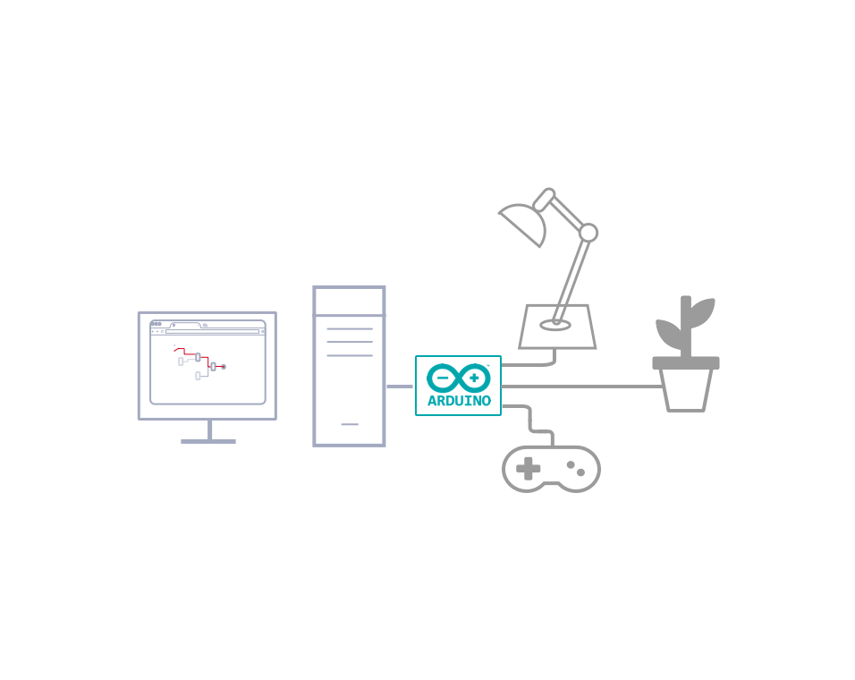

<video autoplay="" loop=""  >
<source src="//benkaminski.com/wp-content/themes/coffee-cream-sugar/img/header-video.mp4" type="video/mp4">
<source src="//benkaminski.com/wp-content/themes/coffee-cream-sugar/img/header-video.ogv" type="video/ogg">
<source src="//benkaminski.com/wp-content/themes/coffee-cream-sugar/img/header-video.webm" type="video/webm">
Your browser does not support the video tag. I suggest you upgrade your browser.
</video>

## What is brainbox
The starting point for *<b>Internet of Things</b>* applications are the things themselves.
brainbox is an authoring system for designers, developers, makers, researchers
and students who want to design and build tangible Internet of Things projects. brainbox
allows anyone to graphically create new unlimited interactions between this physical and virtual objects within a
simple web-browser application without knowing coding or hacking.

## What it is NOT
brainbox is not a (yet another) new home automation server. It's purpose
is to cover key components of networking, IoT and digital circuits to ensure that you understand how to connect
device to the Internet with fun.
 
 

## Easy To Use

  **1. Place**
   
  Select an element. Place it on the board.
   
   
  **2. Connect**
   
  Use the Wire Tool to connect your elements.
   
   
  **3. Test**
   
  Click RUN to start the simulation.

   

## Browser-based editing

    

 brainbox provides a browser-based flow editor that makes it easy to
 wire  things together using the wide range of nodes in the palette. The created files, named *brains*, can be then
 deployed to the runtime in  a single-click. New JavaScript based nodes, named *blocs* can be created within the web based
 designer.

 
 

## Server

 The server part of brainbox handles communication with actual hardware and is built
 on Node.js. It is designed to run on Linux based embedded devices, PCs, on cloud servers. Once a project has been
 authored, the server continues to run the project even when the browser has disconnected.

    

 
 

## Hook up Sensors

### USB

  

Do you want to add wireless capability to your project? Using the NRF24L01+ module is a very easy and
reliable way to do so. This transceiver module works at the 2.4GHz band and it is extremely easy to use with
any Arduino board and brainbox. Download the ready to use Arduino sketches and
connect the wires and you are ready to use them within the browser base editor.  *You can find detailed
information how to setup the RF24 or the arduino in the platform section of this documentation*

### Wireless

Do you want to add wireless capability to your project? Using the NRF24L01+ module is a very easy and
reliable way to do so. This transceiver module works at the 2.4GHz band and it is extremely easy to use with
any Arduino board and brainbox. Download the ready to use Arduino sketches and
connect the wires and you are ready to use them within the browser base editor.  *You can find detailed
information how to setup the RF24 or the arduino in the platform section of this documentation*

   

 
 
 
 
 
 
 
 
 
 
 
 
