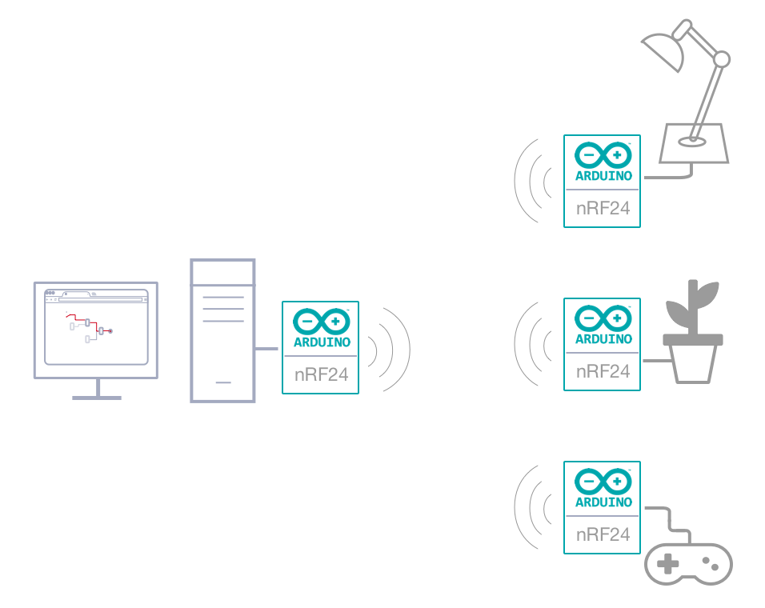

## Overview
Welcome to the brainbox documentation and the awesome world of Iot.
"Brainbox" allows anyone to graphically create new unlimited interactions with connected objects from a simple
web-browser.

 
 
 
 
 

## What the brainbox is NOT
"Brainbox" is not a (yet another) new home automation server. It's purpose is to cover key components of
networking, IoT and digital circuits to ensure that you understand how to connect their device to the Internet with fun.
 
 

## Browser-based editing

    

 brainbox provides a browser-based flow editor that makes it easy to
 wire  things together using the wide range of nodes in the palette. The created files, named *brains*, can be then
 deployed to the runtime in  a single-click. New JavaScript based nodes, named *blocs* can be created within the web based
 designer.

 
 

## Built on Node.js

 The brainbox application runs as a web server on your Raspberry Pi or on
 your Desktop.
 Additional you can connect any arduino or RF24 module to extend the pin count and go wireless

    

 
 

## Connectivity

   

Do you want to add wireless capability to your project? Using the NRF24L01+ module is a very easy and
reliable way to do so. This transceiver module works at the 2.4GHz band and it is extremely easy to use with
any Arduino board and brainbox. Download the ready to use Arduino sketches and connect the wires and you are
ready to use them within the browser base editor.  *You can find detailed information how to setup the RF24 or
the arduino in the platform section of this documentation*

 
 
 
 
 
 
 
 
 
 
 
 
