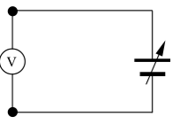

# Analog-Technik und Digital-Technik 

In der Schwachstromelektronik werden heute die beiden Bereiche 
Analog-Technik und Digital-Technik unterschieden.

Ein einfaches Beispiel für diese beiden Begriffe stellt ein 
gewöhnlicher Spannungsmesser dar. Wenn man das Messgerät wie in 
*Abb. 1* an eine regelbare Spannungsquelle anschließt, so vergrößert 
sich der Zeigerausschlag mit zunehmender Spannung. Dabei wird einem 
bestimmten Spannungswert genau eine Zeigerstellung zugeordnet. Dieser 
gleichmäßige Anstieg oder Abfall des Zeigers wird **analoges Verhalten**
genannt.

Dabei ist jeder Zwischenwert der Spannung innerhalb des Messbereiches 
des Spannungsgerätes möglich. Der Ausschlag des Messgerätes entspricht
dabei der angelegten Spannung, oder anders ausgedrückt: die angelegte 
Spannung ist analog zum Zeigerausschlag.

*Abb. 2* zeigt ein typisches Diagramm für analoges Verhalten. Hier ist 
der Zeigerausschlag des Messgerätes in Abhängigkeit der Zeit t 
dargestellt. Es ist deutlich zu sehen, dass jeder beliebige 
Zwischenwert des Ausschlags eingestellt werden kann.

Bei der **Digital-Technik** dagegen wird die Information, die bei der 
Analog-Technik durch den Kurvenverlauf gegeben ist (Zeigerausschlag), 
durch das Ablesen auf der Skala bestimmt. Man ordnet eben jedem 
Zeigerstand einen bestimmten Spannungswert zu. Das ist bei fast allen 
Messgeräten durch die Skala von vornherein schon gegeben. Indem man 
nun die Skalenstriche abzählt, setzt man das analoge Signal 
(Ausschlag des Zeigers) in ein digitales Signal (Anzahl der Striche) 
um. 

**Dabei hat die Digital-Technik gegenüber der Analog-Technik einen großen 
Vorteil**. Während bei analogen Schaltungen der Spannungsbereich meist 
genau stimmen muss, braucht man in digitalen Schaltungen nur den 
richtigen Spannungsbereich einzuhalten. Dies bringt eine **erhöhte 
Stabilität** der digitalen Schaltungen mit sich.

Die beiden Spannungsbereiche, die in der Digital-Technik verwendet 
werden, heißen `L-Bereich` (von engl.: low = niedrig) und `H-Bereich` 
(von engl.: high = hoch). Hier werden für die Beispiele eine 
Versorgungsspannung `Uv = 5V` und die beiden Spannungsbereiche mit 
`0V bis +0,5V` für `L` (low) und `+2,5V bis +5V` für `H` (high) festgelegt, 
da diese Spannungsbereiche außerdem gerade für TTL-Schaltungen 
(TTL = Transistor-Transistor-Logik) oft benötigt werden.

In der mathematischen Beschreibung von digitalen Schaltungen wird der 
L-Bereich mit 0 und der H-Bereich mit 1 beschrieben. Dies ist unter 
anderem für Wahrheitstabellen und *KV-Tafeln*, die in anderen Kapiteln 
zur Anwendung kommen, sehr von Vorteil.
