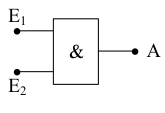

<style>
pre{
 text-align:center;
 padding:20px;
}
</style>


#  AND-Gatter

Die Boolesche Funktionsgleichung (mathematische Gleichung) für das 
AND-Gatter lautet:


```
     A = E1 ∧ E2	   	(sprich: “E1 und E2“)
```

**Das bedeutet, dass  nur dann den Wert 1 hat**, wenn die Eingänge 
`E1` und `E2` den Wert `1` haben. 


**In allen anderen Fällen** hat der Ausgang `A` den Wert `0`.  Anhand 
der Logik-Tafel ist dies leicht zu erkennen. In der Zeile, in der `A`
den Wert 1 hat, haben die beiden Eingänge ebenfalls den Wert 1.


### Logiktabelle

|    E1    |    E2    |     A    |
|:--------:|:--------:|:--------:|
| 0        |      0   |     0    |
| 0        |      1   |     0    |
| 1        |      0   |     0    |
| 1        |      1   |    **1**   |


### Symbol




Hier ist die einfachste `UND-Verknüpfung` gewählt worden, nämlich die 
mit 2 Eingängen. Tatsächlich gibt es jedoch auch AND-Gatter mit mehr  
als zwei Eingängen. Die mathematische Logik bleibt dabei aber 
gleich: 

    Nur wenn alle Eingänge den Wert 1 haben, hat der Ausgang 
    ebenfalls den Wert 1.

Die UND-Verknüpfung wird auch als **Konjunktion** bezeichnet, was so 
viel heißt wie **Bindung**.
