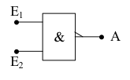

<style>
pre{
 text-align:center;
 padding:20px;
}
</style>


#  NAND-Gatter

Gebildet aus den englischen Worten **not and**, also **nicht und**. Daraus lässt sich bereits schließen, dass die Verknüpfung negiert sein muss. Die mathematische Gleichung bestätigt dies:


```
     A = ¬(E1 ∧ E2) (sprich: “E1 und E2 negiert“)


```

Der Ausgang `A` hat immer den Wert 1, außer wenn beide Eingänge den Wert 1 haben. Anhand der Logik-Tafel lässt sich auch erkennen, dass die NAND-Funktion an ihrem Ausgang genau das entgegengesetzte Signal hat wie das AND-Gatter. 


### Logiktabelle

|    E1    |    E2    |     A    |
|:--------:|:--------:|:--------:|
| 0        |      0   |  **1**   |
| 0        |      1   |  **1**   |
| 1        |      0   |  **1**   |
| 1        |      1   |  **0**   |


### Symbol




