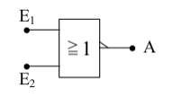
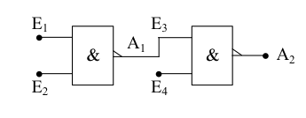
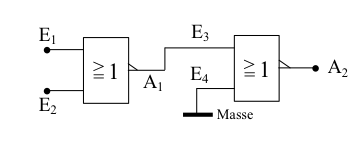

<style>
pre{
 text-align:center;
 padding:20px;
}
</style>


#  NOR-Gatter

Gebildet aus den englischen Wörtern **not or**, was übersetzt **nicht oder** heißt. Es handelt sich also wiederum um eine Negation, nämlich die der OR-Verknüpfung. Die mathematische Gleichung lautet:


```
     A = ¬(E1 ∨ E2) (sprich: “E1 oder E2 negiert“)

```

Bei dieser Verknüpfungsschaltung hat der Ausgang `A` den Wert 1, wenn beide Eingänge den Wert 0 haben. In allen anderen Fällen hat der Ausgang den Wert 0.


### Logiktabelle

|    E1    |    E2    |     A    |
|:--------:|:--------:|:--------:|
| 0        |      0   |  **1**   |
| 0        |      1   |  **0**   |
| 1        |      0   |  **0**   |
| 1        |      1   |  **0**   |


### Symbol




Da diese beiden letzten Gatter sehr häufig vorkommen, haben sie ein eigenes Schaltsymbol. Außerdem sind sie für den Praktiker sehr interessant, da sie gegenüber den *UND-* bzw. *ODER-Gattern* meist erheblich billiger sind. Deshalb nimmt man häufig zwei *NAND-Gatter* um ein *UND-Gatter* billig aufzubauen, oder zwei NOR-Gatter für ein OR-Gatter. Die dafür notwendigen Schaltungen werden im Folgenden erklärt.



Bei dieser Schaltung hat der Ausgang `A1` nur dann den Wert 0, wenn beide Eingänge, also `E1` und `E2` den Wert 1 haben. Der offene (nicht angeschlossene) Eingang `E4` hat generell den Wert 1. Um aber am Ausgang A2 den Wert 1 zu erreichen, muss deswegen `E3` und somit am Ausgang `A1` der Wert 0 anliegen. Dies wird, wie oben schon beschrieben, nur dadurch erreicht, dass man den Eingängen `E1` und `E2` den Wert 1 zuordnet.


Mathematisch ausgedrückt bedeutet dies:


    A1 = ¬(E1 ∧ E2)
    
    A2 = ¬A1 = ¬(¬(E1 ∧ E2))

`¬(¬(E1 ∧ E2))` ist aber nichts anderes als `E1 ∧ E2`; somit gilt die Funktionsgleichung der normalen UND-Verknüpfung:

    A2 = E1 ∧ E2

Dies beweist, dass die obige Schaltung einer normalen UND-Verknüpfung entspricht.




Die Logik dieser Schaltung ist ähnlich der Vorherigen. Der Ausgang `A2` hat nur dann den Wert 0, wenn `E3` den Wert 1 hat. E4 ist durch den Masseanschluss sowieso immer auf 0. Der Wert 1 an `E3` und somit an `A1` wird aber nur erreicht, indem man `E1` und `E2` den Wert 0 zuordnet. In allen anderen Fällen hat `A1` den Wert 0 und damit `A2` den Wert 1. Dies wiederum entspricht genau der OR-Verknüpfung.

Hier der mathematische Beweis:


    A1 = ¬(E1 ∨ E2)
   
    A2 = ¬A1 = ¬(¬(E1 ∨ E2)) = E1 ∨ E2
    
Mit diesen nun beschriebenen **5 Grundschaltungen** (AND-, NAND-, OR-, NOR-Gatter und Inverter) lassen sich **alle** anderen logischen Verknüpfungsschaltungen realisieren. 

Man muss nur die gewünschten Elemente zusammenschalten. Den mathematischen Hintergrund für die Kombination der Gatter liefert die Boolesche Algebra. Die Grundfunktionen sind bei der Erklärung der Schaltungen mit angegeben.


