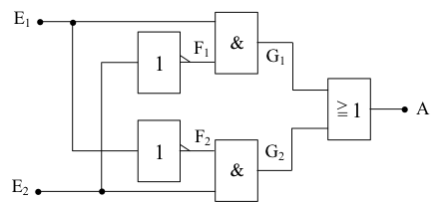

#  EX-OR-Gatter (Exklusiv-ODER)

Eine Variation der Zusammenschaltung der 5 Grundgatter ist das *Exklusiv-ODER*. Im Gegensatz zur ODER-Verknüpfung tritt am Ausgang nicht der Wert 1 auf, wenn beide Eingänge den Wert 1 haben. Diese Funktion entspricht jetzt dem *oder* wie es im normalen Sprachgebrauch verwendet wird. Das heißt, dass am Ausgang der Wert 1 vorliegt, wenn **entwedder `E1` oder `E2`** den Wert 1 haben. Sobald `E1` und `E2` den gleichen Wert haben, liegt am Ausgang A der Wert 0.

### Logiktabelle

|    E1    |    E2    |     A    |
|:--------:|:--------:|:--------:|
| 0        |      0   |  **0**   |
| 0        |      1   |  **1**   |
| 1        |      0   |  **1**   |
| 1        |      1   |  **0**   |

### Symbol

Da diese Verknüpfungsschaltung sehr häufig vorkommt, hat auch sie ihr eigenes Schaltsymbol. Sie kann aber auch durch die Zusammenschaltung von 2 Invertern, 2 AND-Gattern und einem NOR-Gatter aufgebaut werden. Die mathematische Funktion lautet:

    A = (¬E1 ∧ E2) ∨ (E1 ∧ ¬E2

Nun zum Schaltbild des Exklusiv-ODER. Ein Praktiker kann schon anhand der mathematischen Gleichung das Schaltbild zeichnen. Man muss dabei nur genau die Gleichung in die Schaltsymbole der logischen Verknüpfung umwandeln.

Bei dieser Schaltung wollen wir nun einmal einen anderen Weg gehen, der sich vor allem bei komplexen und komplizierteren Schaltungen als sehr einfach herausstellt. Dabei wird an die beiden Eingänge `E1` und `E2` jede mögliche Eingangskombination gelegt und bis zum Ausgang `A` *durchgespielt*. Im vorliegenden Fall sind das genau 4 Kombinationen.

1. An E1 und E2 liegt jeweils der Wert 0. Das obere AND-Gatter hat also am Eingang den Wert 0 von E1 und den Wert 1 vom invertierten E2. Das ergibt einen Zwischenwert G1 = 0. Das untere AND-Gatter hat ebenfalls den Wert 0 (von E2) und den Wert 1 (invertiertes E1) und somit ebenfalls den Zwischenwert G2 = 0. Diese beiden Zwischenwerte liegen nun an einem OR-GATTER, das dadurch am Ausgang den Wert 0 hat. Damit ist die erste Zeile der Logik-Tafel schon festgelegt.

1. Nun legt man an E1 den Wert 0 und an E2 den Wert 1. Da E2 invertiert an das obere AND-Gatter gelangt und E1 von vorneherein 0 ist, erscheint am oberen Zwischenausgang G1 der Wert 0. Beim unteren AND-Gatter sind dagegen beide Eingänge auf dem Wert 1, da E1 invertiert wird und E2 den Wert 1 hat. Das ergibt am Zwischenausgang G2 den Wert 1. Am OR-Gatter liegt also nun einmal der Wert 0 (G1) und einmal der Wert 1 (G2). Der Ausgang A hat somit den Wert 1.

1. Wenn man nun an den Eingang E1 den Wert 1 und an E2 den Wert 0 legt, so läuft die Logik genau den gleichen Weg. Nur liegen dabei die Werte die vorher am oberen AND-Gatter lagen nun am unteren und umgekehrt. Am Ausgang erscheint deshalb wie unter 2. der Wert.

1. Die letzte Kombinationsmöglichkeit ist nun die, dass beide Eingänge E1 und E2 den Wert 1 bekommen. Durch die Invertierung von E2 am oberen und E1 am unteren AND-Gatter haben die Zwischenausgänge G1 und G2 die gleichen Werte, nämlich 0. Eine Parallele dazu ist die erste Kombination. Am Ausgang A erscheint deshalb der Wert 0.

