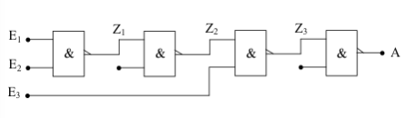

#  AND mit 3 Eingängen aus 4 NAND

Zuerst die AND-Verknüpfung mit 3 Eingängen. Die folgende Tabelle zeigt, dass die abgebildete Schaltung einem AND-Gatter mit 3 Eingängen entspricht. Eingezeichnet sind auch die Zwischenausgänge `Z1`, `Z2` und `Z3`.

|    E1  |  E2  | E3  |  Z1   |  Z2  | Z3  |    A    |
|:------:|:----:|:---:|:-----:|:----:|:---:|:-------:|
| 0      |  0   |  0  |    1  |   0  |  1  | **0**   |
| 0      |  0   |  1  |    1  |   0  |  1  | **0**   |
| 0      |  1   |  0  |    1  |   0  |  1  | **0**   |
| 0      |  1   |  1  |    1  |   0  |  1  | **0**   |
| 1      |  0   |  0  |    1  |   0  |  1  | **0**   |
| 1      |  0   |  1  |    1  |   0  |  1  | **0**   |
| 1      |  1   |  0  |    0  |   1  |  1  | **0**   |
| 1      |  1   |  1  |    0  |   1  |  0  | **1**   |

Nach diesem Schema lässt sich auch eine UND-Schaltung mit 
4 Eingängen aus 6 NAND-Gattern aufbauen usw.

