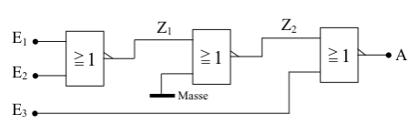

# NOR-Gatter mit 3 Eingängen aus 3 NOR-Gattern

Die folgende Logiktafel mit den Zwischenausgängen gibt auch hier wiederum Auskunft darüber, dass das Verhalten der Schaltung dem eines NOR-Gatters mit 3 Eingängen entspricht.

|    E1  |  E2  | E3  |  Z1   |  Z2  |    A    |
|:------:|:----:|:---:|:-----:|:----:|:-------:|
| 0      |  0   |  0  |    1  |   0  | **1**   |
| 0      |  0   |  1  |    1  |   0  | **0**   |
| 0      |  1   |  0  |    0  |   1  | **0**   |
| 0      |  1   |  1  |    0  |   1  | **0**   |
| 1      |  0   |  0  |    0  |   1  | **0**   |
| 1      |  0   |  1  |    0  |   1  | **0**   |
| 1      |  1   |  0  |    0  |   1  | **0**   |
| 1      |  1   |  1  |    0  |   1  | **0**   |

Auch bei dieser Schaltung lassen sich durch Hinzufügen weiterer NOR-Gatter Schaltungen erzeugen, die sich wie große NOR-Gatter mit noch mehr Eingängen verhalten.
 

