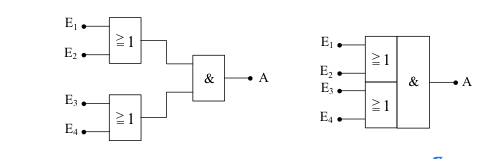
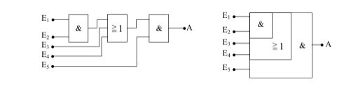
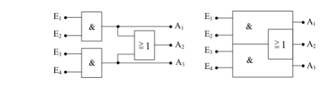

# Kombi Schaltungen

Neben den bisher gezeigten Verknüpfungsschaltungen gibt es noch weitere Schaltsymbole für spezielle Kombinationen. Daher der Name Kombi-Schaltungen. Sie werden in dieser Form sehr häufig für Decoder und andere logische Schaltungen benötigt. Aus diesem Grunde hat man auch für sie vereinfachte Darstellungen gefunden.

## Zwei OR-Gatter, deren Ausgänge über ein AND Gatter verknüpft sind

## AND-Gatter, das mit einem OR-Gatter verknüpft ist

## AND-Gatter verknüpft mit einem OR-Gatter (3 Eingänge) und nachgeschaltetem AND-Gatter

## Zwei AND-Gatter, deren Ausgänge durch ein OR-Gatter miteinander verknüpft sind

