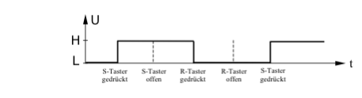

# RS-Flipflop (Setzspeicher)

Dieses Bauteil ist das einfachste Speicherglied der Digitaltechnik. Es kann einen bestimmten Wert über eine gewisse Zeit speichern. Am besten lässt sich das Verhalten an der NAND-Schaltung erklären. Allerdings ist diese Schaltung nur eine Prinzipschaltung, die z.B. nicht das “Warum“ der Speicherung erklärt.

Setzt man in dieser Schaltung den S-Eingang (“Setz-Eingang“) mit dem Taster auf 0, so hat der Ausgang A den Wert 1. Wird dagegen der untere Taster betätigt und somit der R-Eingang (“Rücksetz-Eingang“) auf den Wert 0 gelegt, so erscheint am Ausgang A der Wert 0. Der komplementäre Ausgang ¬A hat immer den entgegengesetzten Wert von A. Das Wesentliche dieser Schaltung ist aber, dass durch Betätigen von z.B. Taster S der Wert 1 am Ausgang “gespeichert“ bleibt – auch nach dem Loslassen der Taste. Und zwar so lange, bis durch Betätigen des Tasters R der Ausgang auf den Wert 0 gesetzt wird. Dabei spielt es keine Rolle, ob der Taster bei S noch gedrückt ist oder nicht. Abb. 30 verdeutlicht das Verhalten der Schaltung. Abb. 31 zeigt das Schaltsymbol für RS-Flipflops.

Den Setzspeicher findet man als IC meist nicht als einzelne Schaltung. Vielmehr haben andere Flipflops wie z.B. das JK-Flipflop das RS-Flipflop integriert. Durch geeignete Beschaltung ist es aber nicht schwer, solch ein Flipflop als RS-Flipflop zu betreiben. In manchen Datenbüchern und Applikationen sind die beiden Eingänge mit `¬R` und `¬S` bezeichnet. Das bedeutet nichts anderes, als eine Unterstreichung der Tatsache, dass z.B. das Setzen nicht durch `S=1`sondern durch `S=0` erfolgt. Und das ist ja nichts anderes als `¬S=1`.
Um nun in einem Übungsaufbau den Wert am Ausgang sofort zu erkennen, empfiehlt es sich, eine Leuchtdiode (LED) dazuzuschalten. Leuchtet sie, so hat der Ausgang den Wert 1. Der komplementäre Ausgang `¬A` hat somit den Wert 0. Ist die LED dunkel, so hat `A` den Wert 0 und `¬A` den Wert 1.

