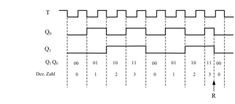

# Dualzähler

Aus dem JK-Flipflop lässt sich nun eine in der Technik oft gebrauchte Zählerschaltung realisieren. Dabei werden oft die Eingänge S und R neben den J- und K-Eingängen benutzt. Der Einfachheit halber werden hier nur die J- und K-Eingänge sowie der R-Eingang verwendet. Natürlich wird auch der Takteingang T angeschlossen.
Wenn man an ein JK-Flipflop einen Takt T anlegt, so hat der Ausgang Q0 bei jeder negativen Taktflanke eine Wertänderung, also einen dauernden Wechsel zwischen 1 und 0. Abb. 37 zeigt den zeitlichen Verlauf des Ausgangs Q0 in Abhängigkeit vom angelegten Takt T. Jetzt wird an das zweite JK-Flipflop das Ausgangssignal Q0 angeschlossen. Somit bestimmt der Ausgang des ersten Flipflops den Takt des zweiten Flipflops. Das Anschlussbild ist in Abb. 36 zu sehen.
Wie man im Spannungsdiagramm der Schaltung erkennt, hat der Ausgang Q1 die halbe Taktfrequenz wie Q0. Dies beruht wiederum darauf, dass eine Umschaltung des Flipflops nur bei einer negativen Taktflanke stattfindet. Die Schaltzustände der beiden Flipflops entsprechen, wie unter dem Diagramm aufgezählt, dem dualen Zählerstand. Der Zähler kann also nur bis zur Zahl 11 des Dualsystems zählen. Das entspricht der dezimalen Zahl 3. Danach kehrt er automatisch wieder zur Anfangszahl 00 zurück.

Wenn nun der Rücksetzeingang R, der oftmals auch Reset-Eingang genannt wird, auf Masse gelegt wird, erscheint auf jeden Fall der Wert 0 an beiden Ausgängen. Dabei ist der Takt nicht von Bedeutung, ebenso die Schaltzustände der beiden Ausgänge Q0 und Q1. Im folgenden Diagramm wird kurz nach dem zweiten Erscheinen der Zahl 11 (dual) der Reset-Eingang aktiviert. Man sieht, dass die beiden Ausgänge sofort den Wert 0 annehmen, obwohl keine negative Flanke vorliegt. Das wurde ja bereits im letzten Abschnitt näher erläutert. Dieser Sachverhalt wird nun bei Zählern angewandt, die bis zu einer bestimmten Zahl zählen sollen, die durch eine einfache Aneinanderreihung von Flipflops nicht erreicht wird. Beispielsweise könnte man mit der in Abb. 36 dargestellten Schaltung einen Zähler bauen, der nach der Zahl 2, also dual 10, auf 0 zurückspringt. Genaueres darüber wird im nächsten Abschnitt behandelt.

