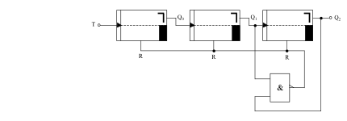

# Dualzähler für beliebige Zahlenreihen

Der Dualzähler des vorherigen Abschnittes konnte nur Dualzahlen eines bestimmten Grades durchzählen. Beispielsweise von 00 bis 11 (entspricht dez. 3) oder bei einer Erweiterung der Schaltung durch zwei weitere JK-Flipflops von 0000 bis 1111 (entspricht dez. 15). Abhilfe gibt es dabei nur durch die Rücksetzung von Hand, das bedeutet den Rücksetzeingang R mit Hilfe eines Schalters auf Masse zu legen. Durch geeignete Verwendung der besprochenen Verknüpfungsschaltungen lässt sich nun der Rücksetzvorgang automatisch bewerkstelligen. Man muss nur die geeigneten Gatter zusammenschalten, die zu einem bestimmten Zeitpunkt den Zähler wieder auf Null zurücksetzt. Bei Zählern mit zwei oder drei JK-Flipflops ist das kein Problem. Selbst bei umfangreicheren Zählern gibt es leichte, sofort durchschaubare Rückstellschaltungen.
Als Beispiel wählen wir einen Zähler, der durch drei Flipflops aufgebaut ist. Das Schaltbild ist in Abb. 38 dargestellt. Dieser Zähler hat jedoch eine automatische Rückstellung bei der Zahl 110. Dies entspricht der dezimalen Zahl 6. 

Wichtig ist die Zahl 6 in diesem Zähler nur für die Rückstellung. In Abb. 39 wurde die Zeitspanne für die Zahl 6 zur besseren Verständlichkeit übertrieben dargestellt. Tatsächlich erscheint diese Zahl so kurz, dass sie für den Zählvorgang keine Bedeutung hat. Es handelt sich hier also um einen Zähler von 0 bis 5. Diese Reihe wird ganz normal durchlaufen. Sobald aber der Zähler am Ausgang Q1 und Q2 gleichzeitig den Wert 1 hat, wird durch das NAND-Gatter der Reset-Eingang aller JK-Flipflops auf 0 gelegt. Der Zähler beginnt erneut von 0 an zu zählen.

Es ist also wichtig, dass bei einem beliebigen Zähler der Rücksetzvorgang mit der nächsthöheren Ziffer des eigentlichen Zählumfangs aktiviert wird. Wenn z.B. ein Zähler bis 18 zählen soll, so muss der Rücksetzeingang durch eine geeignete Verknüpfungsschaltung für die Zahl 19 auf den Wert 0 gelegt werden.

Der Rücksetzeingang bleibt nun so lange auf dem Wert 0, wie in unserem Beispiel Q1 und Q2 den Wert 1 haben. Da aber in wenigen ns der Rücksetzvorgang beendet ist (R hat Priorität), kann die nächste negative Taktflanke für das Umschalten des ersten Flipflops wirksam werden. Somit erscheint nach der dezimalen Zahl 0 (durch den Rücksetzvorgang) im nächsten Takt die 1. Problematisch wird diese Art der Rücksetzung nur bei sehr hohen Taktfrequenzen, oder bei sehr empfindlichen Schaltungen, die bei diesem kurzen Erscheinen der höheren Zahl “umkippen“ können. In diesem Fall muss man sich mit einer anderen Art der Rücksetzung behelfen. Meist genügt jedoch diese Art der Rückstellung. Die Impulsdauer sollte jedoch bei TTL-Schaltungen nicht unter 18 ns liegen, da diese Zeit zum Umschalten benötigt wird.

