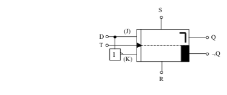
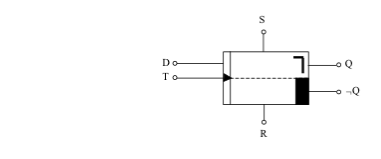

# D-Flipflop (Datenspeicher)

Das D-Flipflop ist ein einfaches Datenspeicherglied. Es kann einen bestimmten Wert abhängig vom Takt T und den Eingängen R und S speichern. Dabei haben die beiden letztgenannten Eingänge wie auch beim JK-Flipflop Priorität. Das bedeutet, dass das Flipflop unabhängig vom Takt einen gewünschten Wert annehmen kann, falls der Setz- bzw. Rücksetzeingang aktiviert wird. Sind diese beiden Eingänge jedoch auf den Wert 1 gesetzt (also nicht aktiv), so erfolgt bei jeder negativen Takt-Flanke eine Übernahme des Dateneingangs D an den Ausgang Q. Der komplementäre Ausgang ¬Q hat auch hier wieder den entgegengesetzten Wert von Q. Das Verhalten von D in Abhängigkeit vom Takt T und den Eingängen S und R zeigt das abgebildete Spannungsdiagramm. 

Die Industrie bietet D-Flipflops schon fertig aufgebaut als ICs an. Haben Sie diese jedoch nicht zur Hand, so kann man mit Hilfe eines JK-Flipflops einen solchen Datenspeicher aufbauen. Dazu ist es notwendig den K-Eingang über einen Inverter an den J-Eingang anzuschließen. An K liegt also ¬J. Wird nun an J der Wert der gewünschten Daten gelegt, so übernimmt das Flipflop bei der nächsten negativen Taktflanke diesen Wert auf den Ausgang Q. Ist z.B. das Flipflop auf dem Wert Q=0 und hat der Dateneingang den Wert D=1, so wechselt nach einer negativen Taktflanke der Ausgang Q seinen Wert von 0 auf 1. Dieser Wert wird so lange gespeichert, bis über den Takt T und einen neuen Wert an D der Zustand von Q geändert wird. Natürlich wäre eine Änderung auch durch eine Aktivierung von S oder R möglich.

Ein wichtiges Anwendungsbeispiel eines D-Flipflops ist das Schiebe­register. Dieses Bauteil ist in einem eigenen Kapitel noch genauer erklärt.
