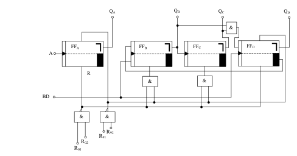

# Frequenzteiler

In der Praxis wird man nun recht selten einen Zähler mit einzelnen JK-Flipflops aufbauen. Vielmehr nimmt man Zähler bzw. Teiler, die als integrierte Schaltungen (ICs) angeboten werden. Eine solche Schaltung ist z.B. der IC “SN 7490“.
Mit dieser Schaltung lassen sich Frequenzteiler realisieren, die im folgenden beschrieben sind. Außerdem ist es ein häufig benötigter Zähler-IC, der von 0 bis 9 zählt und dann bei entsprechender Beschaltung wieder auf 0 zurück geht.

Das Prinzipschaltbild zeigt, dass auch hier 4 JK-Flipflops verwendet wurden. Hier werden zum Teil auch die Setzeingänge der Flipflops verwendet. Das bringt den Vorteil, dass Verknüpfungsschaltungen für die Rücksetzung entfallen und die Schaltung kann dadurch billiger realisiert werden.

Als Takteingang dient hier je nach Anforderung der Eingang A oder der Eingang BD, der auch in verschiedenen Datenbüchern mit B gekennzeichnet ist.

Mit den Eingängen R01 und R02 kann man eine Nullstellung “erzwingen“ indem man an beide Eingänge ein High-Signal legt. Ebenso ist es möglich mit Hilfe der beiden Eingänge R91 und R92 eine Neun-Stellung zu erzwingen. Mit einer entsprechenden Verknüpfungsschaltung ist es also möglich, jede Art von Zähler zwischen 0 und 9 aufzubauen indem man den Zähler beim gewünschten Stand wieder auf Null setzt. Für den Zähler von 0 bis 9 werden diese vier Eingänge auf Masse gelegt.

Den Anschluss des ICs zeigt die folgende Abbildung. Im Gegensatz zu den Transistoren werden allerdings sämtliche Pinbelegungsbilder mit den Anschlussbeinen nach unten gezeichnet. Man stellt also den IC auf die “Füße“ und betrachtet ihn von oben, nicht von unten!

Zur Erkennung der linken oder rechten Seite eines integrierten Schaltkreises ist bei Pin 1 bzw. Pin 14 (Pin = Anschlussbeinchen) eine Kerbe oder eine punktförmige Vertiefung angebracht. Dadurch ist die Benennung des Pins sofort zu erkennen. Eingezeichnet wird dies auch auf dem Applikationsbild (Anschlussbild).

Die Anschlüsse 4 und 13 sind bei diesem Bild nicht gekennzeichnet. Das bedeutet, dass sie keinen Anschluss zur inneren Schaltung des Zählers haben. Gewöhnlich werden solche Anschlüsse mit “NC“ gekennzeichnet, was ausgeschrieben “Non Connect“ (nicht angeschlossen) heißt.

Bei Pin 14 und 1 sieht man innerhalb des ICs den Invertierungspunkt. Das bedeutet, dass bei einem L-Impuls (hier negative Flanke, da negativflankengetriggertes Flipflop) eine Umschaltung geschehen kann.

Oftmals werden auch in Datenbüchern die Benennungsbuchstaben mit einem Komplementär-Zeichen gekennzeichnet. Das wäre in diesem Fall ¬A oder ¬BD. Die Ausgänge QA, QB, QC, QD sind Ausgänge der Flipflops und bezeichnen die Dualstelle der dualen Zahl am Ausgang. Bei der Dualzahl 1100 hat also QD und QC den Wert 1, QB und QA haben den Wert 0.

Die Spannung wird an Pin 10 (Masse) und Pin 5 (positiver Pol der Versorgungsspannung) angeschlossen.

