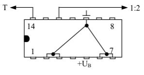
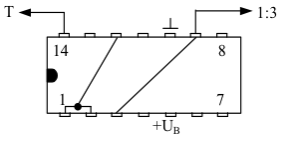
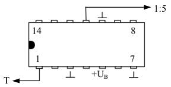
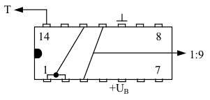
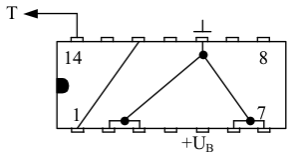

# SN 7490 als Teiler

### Frequenzteiler 1:2
Hierbei wird nur das Eingangsflipflop des ICs verwendet. Die vier Rückstelleingänge R01, R02, R91 und R92 sind mit Masse verbunden.

### Frequenzteiler 1:3
Der Takt wird hier an den Eingang des Flipflops FFA gelegt. Der Ausgang dieses Flipflops ist mit BD verbunden. Die Ausgänge QA und QB sind an die Rückstelleingänge R01 und R02 angeschlossen.
Eine Rückstellung erfolgt dann, wenn diese beiden Ausgänge ein H-Signal aufweisen.

|

### Frequenzteiler 1:5
Der Takt wird auf den Eingang BD gelegt. Somit arbeitet der Zähler nur mit der Teilerkette FFB, FFC und FFD. Durch diese Beschaltung wird ein Teilerverhältnis von 1:5 erreicht.

 

### Frequenzteiler 1:9
QA wird mit dem Flipflop-Eingang BD und mit R01 verbunden. Außerdem muss QD an R02 angeschlossen werden.
Tritt nun an QA und QD gleichzeitig ein H-Signal auf, so wird der Zähler wieder auf 0 zurückgesetzt.

 

### Frequenzteiler 1:10
Diese Schaltung ist nun der eigentliche Zählbetrieb des ICs. Sämtliche Rückstelleingänge sind mit Masse verbunden. Der Eingang BD der Flipflop-Kette FFB, FFC und FFD ist mit dem Ausgang QA verbunden. An den Ausgängen QA, QB, QC und QD können nun die dualen Daten des Zählerstandes entnommen werden.

Im letzten Fall nehmen die Ausgänge also die Werte von 0000 bis 1001 (dez. 9) an. Diese Signale können nun weiter verwendet werden um z.B. einen 7-Segment-Decoder zu steuern. Dieser wiederum zeigt den Zählerstand durch ein LED Siebensegment an.
Zur Verdeutlichung kann man auch hier eine Logik-Tafel aufstellen. Sie sagt aus, dass eine Rückstellung nur dann erfolgen kann, wenn beide Rücksetzeingänge R01 und R02 (oder R91 und R92) ein H-Signal erhalten.
