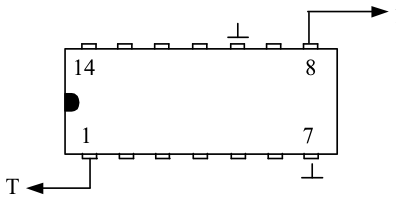

# Integrierter Zähler und Teiler 7492

Dieser IC ist ähnlich aufgebaut wie der vorher besprochene Zähler 7490. Er besteht ebenfalls aus 4 JK-Flipflops, nur sind hier andere Teilerverhältnisse zu erreichen, die im Folgenden beschrieben sind.

Das Teilerverhältnis 1:2, das nicht extra aufgeführt ist, kann man durch eine analoge Beschaltung wie beim Zähler 7490 erreichen. Auch hier wird das 

Eingangsflipflop für die Teilung verwendet. Wie man aus dem Prinzipschaltbild erkennt, hat dieses Bauteil keine Rücksetzung auf 9. Es ist nur eine Rückstellung auf 0 möglich. Der Eingang der Flipflopkette ist hier mit BC beschriftet. In manchen Datenbüchern wird er ebenso wie beim 7490 mit “B“ gekennzeichnet.

Die Pinbelegung stimmt mit dem vorherigen Zähler in Aus- und Eingängen überein. Nur die Rückstelleingänge für 0 liegen diesmal bei Pin 6 und 7. Ohne Anschluss, also NC (Non Connect) sind die Anschlüsse 2, 3, 4 und 13. Die Stromversorgung stimmt ebenfalls mit dem Zähler 7490 überein.

---

### Frequenzteiler 1:6
Das Eingangsflipflop wird hier nicht verwendet. Nur die Teilerkette FFB, FFC und FFD ist angeschlossen

|

### Frequenzteiler 1:12
Einer der beiden Rückstelleingänge muss auf Masse gelegt werden. Der Ausgang QA wird mit dem Eingang BC verbunden. Somit befinden sich alle Flipflops in Betrieb.

|

---- 
Generell kann man an den Ausgängen der verwendeten Flipflops die H- bzw. L-Signale abgreifen. So kann man also den oberen Teiler mit Teilerverhältnis 1:6 auch als “Fünfzähler“ verwenden. Der Zähler beginnt mit der Zahl 0 und schaltet nach 5 wieder auf 0 zurück. Oder man kann mit einem Teiler 1:9 beim 7490 einen “Achterzähler“ aufbauen. Dieser beginnt ebenfalls mit der Zahl 0 zu zählen und schaltet nach der Zahl 8 auf 0 zurück.

Mit diesen Zählern kann man nun verschiedene auch für den täglichen Gebrauch sehr nützliche Schaltungen aufbauen. So z.B. eine Digitaluhr, Impulszähler, Frequenzmesser mit digitaler Anzeige, Stoppuhren und viele andere Zählschaltungen.

Doch vorerst haben wir nur das duale Signal. Dieses muss durch eine geeignete Decoderschaltung in ein sichtbares, sofort erkennbares Signal umgeformt werden. Bei unseren Zählerschaltungen empfiehlt sich die Umformung in einen Code, der durch eine 7-Segmentanzeige angezeigt werden kann. Ein solcher Decoder kann durch geeignete Verknüpfungsschaltungen aufgebaut werden. Da diese Schaltung aber sehr umfangreich würde, empfiehlt es sich auch hier auf einen schon fertigen Decoder zurückzugreifen, wie er im nächsten Kapitel beschrieben wird.

