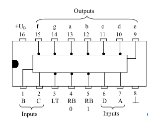

# BCD-to-7-Segment Decoder

Die Abkürzung BCD steht für “binary coded decimal“ und meint einfach die binäre Darstellung einer Dezimalzahl. Ein BCD-to-7-Segment Decoder wandelt nun ein solches Signal in entsprechende Steuersignale für eine 7-Segmentanzeige um. Das bedeutet, dass ein duales Signal an die Eingänge dieser Schaltung gelegt wird und dieses Signal in einen Code für die 7-Segmentanzeige umgewandelt wird. Aber was ist jetzt eigentlich eine 7-Segmentanzeige?

Eine solche Anzeige besteht aus 7 LEDs (Licht emittierende Dioden). Eine Leuchtdiode sendet Licht aus, wenn sie in Durchlassrichtung geschaltet ist. Das Material ist meist Galliumarsenid. Das Leuchten entsteht in dem Grenzgebiet zwischen der n- und der p-Zone des Halbleiterelements, durch die Energie der bewegten Ladungsträger. Der Durchlassstrom, der zum Leuchten durch die Diode fließen muss, liegt bei etwa 1 mA. Dies ist eine ideale Voraussetzung für die am Ausgang nicht stark belastbaren Gatterschaltungen. Somit hat eine Leuchtdiode gegenüber einer normalen Glühlampe den Vorteil, dass zum Aussenden von Licht ein weitaus geringerer Strom benötigt wird, und somit eine umfangreiche Schaltung zur Stromverstärkung entfallen kann.

Unterschiede zwischen verschiedenen Leuchtdioden gibt es nicht nur in der Leuchtfarbe (rot, gelb, grün, blau, weiß), sondern auch in der Bauteilgröße: Von Subminiatur bis Normal-Grösse sind sie im Handel erhältlich, je nach Geschmack und Anforderung.
Die 7-Segmentanzeige wird überall dort verwendet, wo Zahlen angezeigt werden sollen, z.B. in Taschenrechnern und digitalen Uhren. Die Anordnung der 7 LEDs ist so gewählt, dass jede Ziffer zwischen 0 und 9 und einige Sondersymbole dargestellt werden können. Um eine einheitliche Benennung der Segmente zu erreichen, werden die einzelnen Leuchtdioden mit den kleinen Buchstaben a, b, c, d, e, f und g benannt.

Um die Ziffer 0 mit einer solchen Anzeige aufleuchten zu lassen, müssen die Segmente a, b, c, d, e und f zum Leuchten gebracht werden. Und genau diese Aufgabe übernimmt der Decoder. Das duale Signal, das z.B. von einem Zähler kommen kann, ist im Fall der Ziffer 0 ein 0-Wert an allen Eingängen, also 0000. Oder anders ausgedrückt: Die Ausgänge QA, QB, QC und QD eines Zählers, die gleichzeitig die Eingänge des Decoders sind, haben bei der dezimal angezeigten Zahl 0 alle den Wert 0. Intern wird dieses angelegte Signal weiterverarbeitet, um als dezimale Ziffer auf der 7-Segmentanzeige angezeigt werden zu können.

Ein solcher BCD-to-7-Segment Decoder ist z.B. der IC “SN 7447“. Die Pinbelegung ist in Abb. 54 zu sehen. Die Versorgungsspannung liegt an Pin 8 und 16, die Ausgänge a, b, c, d, e, f und g an den Pins 9 bis 15. Diese Ausgänge sind innerhalb der Schaltung invertiert, d.h. bei einem 1-Signal liegt am Ausgang der Wert 0 (was dem Minuspol der Spannungsquelle entspricht). Da 7-Segmentanzeigen mit gemeinsamer Anode und gemeinsamer Kathode angeboten werden, muss bei einer Invertierung der Ausgänge immer eine Anzeige mit gemeinsamer Anode genommen werden. Die Anode wird an den Pluspol der Versorgungsspannung angeschlossen. Der Minuspol (Masseanschluss) entspricht dem Wert 0 und wird vom Decoder am Ausgang geliefert.

Beim Anschluss der 7-Segmentanzeige wird zuerst der gemeinsame Anoden-Pin an den Pluspol der Versorgungsspannung angeschlossen. Der Anschluss “dp“, der für den Dezimalpunkt vorgesehen ist, kann offen gelassen werden. Um ihn zu steuern, ist eine weitere Verknüpfung notwendig. Verwendet wird er z.B. beim Taschenrechner, um die Kommastelle zu markieren. Für einen Zählerbausatz ist dies aber nicht unbedingt notwendig.

Der Anschluss “LT“ ist ein Lampentest-Eingang, der durch einen Masseanschluss aktiviert werden kann. Masseanschluss deshalb, weil auch hier intern eine Invertierung vorgenommen wird. Ist dieser Pin an den Massepool angeschlossen, so leuchten sämtliche Segmente für diese Zeit auf. Somit ist ein Test der einzelnen Leuchtdioden möglich. Weiterhin ist eine Helligkeitssteuerung und eine Unterdrückung von führenden Nullen möglich.

Die Anzeige der einzelnen Segmente zeigt Abb. 55. Unter den schematischen Segmentbildern ist der Zählerstand beim Decodereingang aufgezählt. Wie man sieht, erscheinen ab der Zahl 10 Sondersymbole. Dies kommt daher, dass mit einem Segment nur Zahlen von 0 bis 9 möglich sind, der Decoder aber durch die vier Eingänge bis zur dualen Zahl 1111 (dezimal 15) zu steuern ist.

