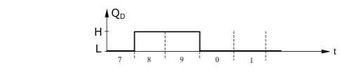
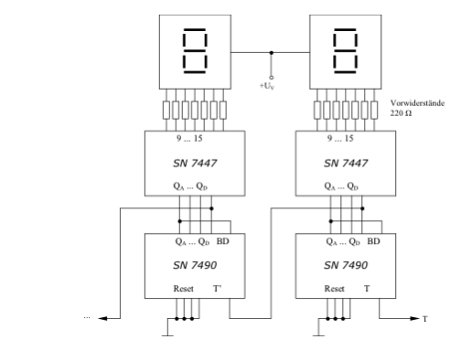

# BCD-to-7-Segment Decoder

Dies ist eine Kombination des Dezimalzählers SN 7490 und des BCD-to-7-Segment Decoders SN 7447. Der Decoder gibt das empfangene Signal des Zählers umgeformt an die 7-Segment-Anzeige mit gemeinsamer Anode weiter. Das Taktsignal (z.B. von einem Taktgeber) wird an den rechten Zähler gelegt. Durch seine Beschaltung zählt er von 0 bis 9, kehrt danach auf 0 zurück und beginnt von Neuem mit dem Zählvorgang. Das erreicht man, wie schon beschrieben, indem man die Rücksetzeingänge R01, R02, R91 und R92 (hier mit Reset bezeichnet) auf Masse legt. Außerdem muss der Ausgang QA mit dem Eingang BD verbunden werden. Der Zähler gibt nun sein Signal an den Decoder weiter. Dabei werden die Ausgänge des Zählers mit den dazugehörigen Eingängen des Decoders verbunden, d.h. der Ausgang QA mit dem Eingang A usw.

Der Decoder formt das Signal des Dezimalzählers in einen Code um, der durch die 7-Segment-Anzeige als Zahl sichtbar wird.

Die Steuerung des zweiten Zählers erfolgt bei der Rücksetzung des ersten Zählers auf 0. Der Ausgang QD des ersten Zählers, der ab der Zahl 8 (entspr. 1000) den Wert 1 hat, erzeugt bei der Rückstellung eine negative Flanke, die für eine Taktung des zweiten Zählers ausgenutzt wird. Das Spannungsdiagramm dieses Ausgangs ist unten abgebildet.

Mit diesem Schaltungsschema können nun beliebig viele Zähler aneinander gereiht werden.

Bei dem vorliegenden Zähler ist ein Zählerstand von 00 bis 99 möglich. Nicht zu vergessen ist, dass die gemeinsame Anode der 7-Segment-Anzeige an den Pluspol der Versorgungsspannung angeschlossen werden muss. Ebenso ist es noch nötig die Stromversorgung, die hier nicht eingezeichnet wurde, an die Zähler und die Decoder anzuschließen.

Getaktet wird die ganze Schaltung mit einem der besprochenen Taktgeber, also entweder mit Einzelimpulsen oder Folgeimpulsen.

