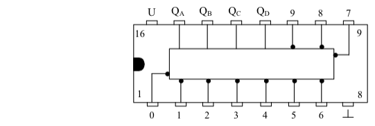

# BCD-to-Decimal Decoder

Diese Schaltung ist eine weitere Decoderschaltung. Sie setzt nicht wie beim vorherigen Decoder das duale Signal (BCD-Signal) in ein Signal für eine 7-Segment-Anzeige um, sondern liefert ein dezimales Signal. Das heißt konkret, dass bei einem gewissen Zählerstand des Eingangs ein Signal an einem bestimmten Ausgang erscheint. Wird z.B. an den Eingang des Decoders das duale Signal 0000 gelegt, das der dezimalen Zahl 0 entspricht, so erhält der Ausgang mit der Nummer 0 das Signal. Oder, um ein weiteres Beispiel zu nennen, wenn am Eingang das duale Signal 0110 angelegt wird (entspr. dezimal 6) so liegt am Ausgang 6 das ausgehende Signal.

Die Abbildung zeigt einen solchen BCD-to-Decimal Decoder, es ist der IC “SN 7445“. Wie man sieht, hat er genau 10 Ausgänge, beschriftet mit “0“ bis “9“. An ihnen kann das invertierte Signal, also ein L-Wert, abgegriffen werden. An die Eingänge QA, QB, QC und QD wird das duale Signal, das z.B. von einem Dezimalzähler kommen kann, angelegt.
Da der Decoder nur Ausgänge von 0 bis 9 hat, können nur duale Zahlen bis einschliesslich 1001 decodiert werden. Diese Zahl entspricht genau der dezimalen Zahl 9. Die angelegten Werte über dieser Grenze, also Zahlen von 10 bis 15 bewirken keine Signalübermittlung an den Ausgängen. An ihnen erscheint dann generell der Wert 1, da ja die Ausgänge invertiert sind.
Dieser Schaltkreis kann z.B. eine LED-Kette steuern. Dazu wird an die Eingänge QA, QB, QC und QD das Signal eines Dezimalzählers angeschlossen. Man kann nun genau ablesen, welchen Zählerstand der Dezimalzähler gerade hat. Wechseln die einzelnen Werte am Eingang des Decoders in schnelleren Schritten, d.h. wird an den Zähler eine höhere Taktfrequenz angelegt, so erhält man ein Lauflicht. Die dunkle Leuchtdiode wec